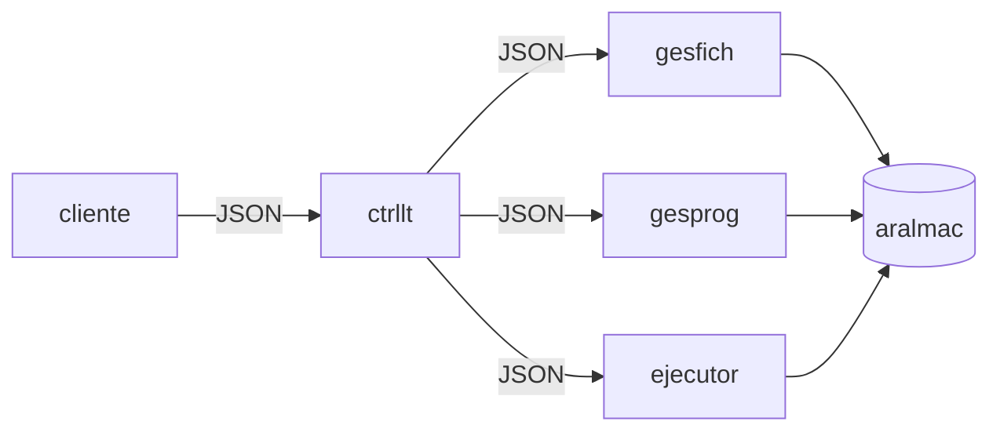

# Diseño del API JSON - Ejecutor de lotes

## 1. Información general

**Materia:** Sistemas Operativos  
**Proyecto:** Ejecutor de lotes  
**Entrega:** Primera entrega  
**Integrantes:**  
- Juan Esteban Barrios Tovar
- Alejandro García Cortes

## 2. Alcance de la primera entrega

Esta entrega define el diseño del API de comunicación del sistema Ejecutor de lotes. Según el enunciado, los mensajes entre procesos deben usar formato JSON y la comunicación se realizará mediante tuberías nombradas.

El objetivo de este documento es especificar:

- La estructura general de los mensajes JSON.
- Las operaciones expuestas por cada servicio.
- Los parámetros esperados para cada operación.
- El formato de las respuestas exitosas y de error.
- Los estados relevantes de cada servicio.

No se incluye código en esta entrega.

## 3. Componentes del sistema

El sistema está compuesto por los siguientes procesos:

- `cliente`: proceso externo que registra, consulta, borra y actualiza programas y ficheros; también lanza, consulta y termina procesos de lotes. No hace parte de esta entrega.
- `ctrllt`: controlador de lotes. Recibe las solicitudes de uno o más clientes y las redirige al servicio correspondiente.
- `gesfich`: gestor de ficheros almacenados en `aralmac`.
- `gesprog`: gestor de programas almacenados en `aralmac`.
- `ejecutor`: ejecuta y administra procesos de lotes usando programas y ficheros registrados.
- `aralmac`: área de almacenamiento persistente usada por `gesfich`, `gesprog` y `ejecutor`.



## 4. Supuestos y aclaraciones de la práctica

Con base en el enunciado y la sesión de preguntas, se tendrán en cuenta las siguientes reglas:

- Para esta etapa del proyecto se diseña el API JSON; las decisiones detalladas de implementación quedan para la segunda entrega.
- El diseño conserva el soporte conceptual para múltiples clientes, tal como indica el enunciado. Para pruebas iniciales puede usarse un único cliente, sin que esto elimine del diseño la posibilidad de múltiples clientes concurrentes.
- `ctrllt` funciona principalmente como pasarela: recibe peticiones, las redirige y devuelve respuestas al cliente.
- `ctrllt` no expone una operación propia de consulta de estado, como número de clientes conectados.
- Si `ctrllt` recibe una operación de terminación, debe cerrar ordenadamente los servicios administrados y luego terminar él mismo.
- `ejecutor` accede directamente a `aralmac` para validar programas y ficheros; no consulta a `gesfich` ni a `gesprog` mediante tuberías.
- Los datos de `aralmac` deben permanecer entre ejecuciones del sistema.
- Cuando `ejecutor` está suspendido, los lotes que ya están en ejecución continúan corriendo. El servicio suspendido rechaza nuevas solicitudes de ejecución.
- La operación `ejecutar` no debe bloquear al cliente hasta que termine el lote. Debe validar la solicitud, crear el lote, retornar inmediatamente un identificador y dejar la ejecución en segundo plano.
- `ejecutor` puede tener varios lotes ejecutándose simultáneamente.
- Si un fichero está siendo usado por un lote, se considera bloqueado temporalmente y no debe ser borrado ni modificado hasta que el lote termine.

## 5. Comunicación mediante tuberías nombradas

La comunicación entre procesos se realizará mediante tuberías nombradas.

En sistemas con tuberías full-duplex puede usarse una sola tubería para petición y respuesta. En sistemas con tuberías half-duplex se usarán dos tuberías: una para peticiones y otra para respuestas.

Para delimitar mensajes sobre la tubería, se enviará un objeto JSON completo por mensaje. En la implementación futura puede usarse un salto de línea como separador entre mensajes JSON consecutivos.

Ejemplos de nombres:

| Sistema operativo | Peticiones | Respuestas |
|---|---|---|
| Linux | `/tmp/ctrllt_req` | `/tmp/ctrllt_res` |
| Windows 11 | `\\.\pipe\ctrllt_req` | `\\.\pipe\ctrllt_res` |

Cada tubería utilizada debe tener un nombre único.

### 5.1. Sinopsis de conexión

Las opciones de ejecución siguen la estructura propuesta en el enunciado.

```bash
cliente -c <tuberia-nombrada> [-a <tuberia-nombrada>]
```

```bash
gesfich -f <tuberia-nombrada> [-b <tuberia-nombrada>] -x <info-aralmac>
```

```bash
gesprog -p <tuberia-nombrada> [-c <tuberia-nombrada>] -x <info-aralmac>
```

```bash
ejecutor -e <tuberia-nombrada> [-d <tuberia-nombrada>] -x <info-aralmac>
```

```bash
ctrllt -c <tuberia-nombrada> [-a <tuberia-nombrada>] \
       -f <tuberia-nombrada> [-b <tuberia-nombrada>] \
       -p <tuberia-nombrada> [-c <tuberia-nombrada>] \
       -e <tuberia-nombrada> [-d <tuberia-nombrada>]
```

Las opciones obligatorias identifican las tuberías de petición. Las opciones entre corchetes identifican tuberías de respuesta para sistemas que requieran comunicación half-duplex.

## 6. Convenciones del API

### 6.1. Identificadores

| Recurso | Formato | Ejemplo |
|---|---|---|
| Petición | `r-XXXX` | `r-0001` |
| Fichero | `f-XXXX` | `f-0001` |
| Programa | `p-XXXX` | `p-0001` |
| Lote | `l-XXXX` | `l-0001` |

`XXXX` representa cuatro dígitos decimales.

### 6.2. Estados de servicio

Los servicios `gesfich` y `gesprog` manejan:

- `corriendo`
- `suspendido`
- `terminado`

El servicio `ctrllt` maneja:

- `corriendo`
- `terminado`

El servicio `ejecutor` maneja:

- `corriendo`
- `suspendido`
- `parando`
- `terminado`

### 6.3. Estados de lote

Un lote puede estar en alguno de los siguientes estados:

- `ejecutando`
- `terminado`
- `fallido`
- `matado`

### 6.4. Reglas por estado

Cuando `gesfich` o `gesprog` están en estado `suspendido`, no ejecutan operaciones de modificación o consulta de recursos; solo aceptan operaciones administrativas que permitan reanudar o cerrar el servicio.

Cuando `ejecutor` está en estado `suspendido`, no acepta nuevas operaciones `ejecutar`. Los lotes que ya estaban corriendo continúan su ejecución.

Cuando `ejecutor` está en estado `parando`, no acepta nuevos lotes y espera a que el número de lotes activos llegue a cero para finalizar.

## 7. Estructura general de mensajes

### 7.1. Petición

```json
{
  "request_id": "r-0001",
  "service": "gesfich",
  "operation": "crear",
  "params": {}
}
```

Campos:

| Campo | Tipo | Obligatorio | Descripción |
|---|---|---|---|
| `request_id` | string | Sí | Identificador único de la petición. |
| `service` | string | Sí | Servicio destino: `ctrllt`, `gesfich`, `gesprog` o `ejecutor`. |
| `operation` | string | Sí | Operación solicitada. |
| `params` | object | Sí | Parámetros de la operación. Si no hay parámetros, se envía `{}`. |

### 7.2. Respuesta exitosa

```json
{
  "request_id": "r-0001",
  "status": "ok",
  "data": {}
}
```

### 7.3. Respuesta con error

```json
{
  "request_id": "r-0001",
  "status": "error",
  "error": {
    "code": "NOT_FOUND",
    "message": "El recurso solicitado no existe"
  }
}
```

## 8. Códigos de error

| Código | Descripción |
|---|---|
| `INVALID_JSON` | El mensaje recibido no es un JSON válido. |
| `INVALID_REQUEST` | Faltan campos obligatorios o tienen tipos incorrectos. |
| `INVALID_SERVICE` | El servicio solicitado no existe. |
| `INVALID_OPERATION` | La operación no existe para el servicio indicado. |
| `INVALID_ID` | Un identificador no cumple el formato esperado. |
| `NOT_FOUND` | El recurso solicitado no existe. |
| `SUSPENDED_SERVICE` | El servicio está suspendido y no acepta la operación solicitada. |
| `RESOURCE_LOCKED` | El fichero está bloqueado por un lote en ejecución. |
| `STORAGE_ERROR` | Error al leer o escribir en `aralmac`. |
| `PROCESS_ERROR` | Error al crear, consultar o terminar un proceso de lote. |

## 9. API de `ctrllt`

`ctrllt` recibe solicitudes de uno o más clientes y las redirige al servicio indicado en el campo `service`. Cada petición se correlaciona con su respuesta mediante `request_id`, de forma que el controlador pueda devolver la respuesta al cliente que originó la solicitud.

### 9.1. Enrutamiento

Si el mensaje tiene como destino `gesfich`, `gesprog` o `ejecutor`, `ctrllt` lo reenvía al servicio correspondiente y retorna al cliente la respuesta recibida.

### 9.2. Terminar

Solicita el cierre ordenado del sistema.

Petición:

```json
{
  "request_id": "r-0002",
  "service": "ctrllt",
  "operation": "terminar",
  "params": {}
}
```

Respuesta:

```json
{
  "request_id": "r-0002",
  "status": "ok",
  "data": {
    "estado": "terminado"
  }
}
```

Regla: antes de terminar, `ctrllt` debe solicitar la terminación de `gesfich` y `gesprog`, y debe solicitar a `ejecutor` la operación `parar` para que deje de aceptar nuevos lotes y espere los procesos activos.

### 9.3. Contrato resumido

| Operación | Parámetros obligatorios | Respuesta exitosa |
|---|---|---|
| `terminar` | Ninguno | `estado` |

## 10. API de `gesfich`

`gesfich` administra ficheros en `aralmac`.

### 10.1. Crear fichero

Crea un fichero vacío y retorna su identificador.

```json
{
  "request_id": "r-0101",
  "service": "gesfich",
  "operation": "crear",
  "params": {}
}
```

Respuesta:

```json
{
  "request_id": "r-0101",
  "status": "ok",
  "data": {
    "id_fichero": "f-0001"
  }
}
```

### 10.2. Leer fichero

Consulta el contenido de un fichero.

```json
{
  "request_id": "r-0102",
  "service": "gesfich",
  "operation": "leer",
  "params": {
    "id_fichero": "f-0001"
  }
}
```

Respuesta:

```json
{
  "request_id": "r-0102",
  "status": "ok",
  "data": {
    "id_fichero": "f-0001",
    "contenido": "contenido actual del fichero"
  }
}
```

### 10.3. Listar ficheros

Si no se envía `id_fichero`, se retorna la información de todos los ficheros registrados.

```json
{
  "request_id": "r-0103",
  "service": "gesfich",
  "operation": "leer",
  "params": {}
}
```

Respuesta:

```json
{
  "request_id": "r-0103",
  "status": "ok",
  "data": {
    "ficheros": [
      {
        "id_fichero": "f-0001",
        "bloqueado": false
      }
    ]
  }
}
```

### 10.4. Actualizar fichero

Copia el contenido de un fichero externo hacia un fichero registrado en `aralmac`.

```json
{
  "request_id": "r-0104",
  "service": "gesfich",
  "operation": "actualizar",
  "params": {
    "id_fichero": "f-0001",
    "ruta_origen": "datos/entrada.txt"
  }
}
```

Respuesta:

```json
{
  "request_id": "r-0104",
  "status": "ok",
  "data": {
    "id_fichero": "f-0001",
    "actualizado": true
  }
}
```

### 10.5. Borrar fichero

Elimina un fichero registrado. Si el fichero está siendo usado por un lote, debe responder con `RESOURCE_LOCKED`.

```json
{
  "request_id": "r-0105",
  "service": "gesfich",
  "operation": "borrar",
  "params": {
    "id_fichero": "f-0001"
  }
}
```

Respuesta:

```json
{
  "request_id": "r-0105",
  "status": "ok",
  "data": {
    "id_fichero": "f-0001",
    "borrado": true
  }
}
```

### 10.6. Suspender

```json
{
  "request_id": "r-0106",
  "service": "gesfich",
  "operation": "suspender",
  "params": {}
}
```

### 10.7. Reasumir

```json
{
  "request_id": "r-0107",
  "service": "gesfich",
  "operation": "reasumir",
  "params": {}
}
```

### 10.8. Terminar

```json
{
  "request_id": "r-0108",
  "service": "gesfich",
  "operation": "terminar",
  "params": {}
}
```

### 10.9. Contrato resumido

| Operación | Parámetros obligatorios | Parámetros opcionales | Respuesta exitosa |
|---|---|---|---|
| `crear` | Ninguno | Ninguno | `id_fichero` |
| `leer` | Ninguno | `id_fichero` | `contenido` o lista `ficheros` |
| `actualizar` | `id_fichero`, `ruta_origen` | Ninguno | `id_fichero`, `actualizado` |
| `borrar` | `id_fichero` | Ninguno | `id_fichero`, `borrado` |
| `suspender` | Ninguno | Ninguno | `servicio`, `estado` |
| `reasumir` | Ninguno | Ninguno | `servicio`, `estado` |
| `terminar` | Ninguno | Ninguno | `servicio`, `estado` |

## 11. API de `gesprog`

`gesprog` administra programas en `aralmac`.

### 11.1. Guardar programa

Registra un ejecutable, sus argumentos y su ambiente.

```json
{
  "request_id": "r-0201",
  "service": "gesprog",
  "operation": "guardar",
  "params": {
    "nombre": "contador",
    "ruta_ejecutable": "programas/contador",
    "argumentos": ["--modo", "rapido"],
    "ambiente": {
      "APP_MODE": "batch"
    }
  }
}
```

Respuesta:

```json
{
  "request_id": "r-0201",
  "status": "ok",
  "data": {
    "id_programa": "p-0001"
  }
}
```

### 11.2. Leer programa

Consulta la información registrada para un programa.

```json
{
  "request_id": "r-0202",
  "service": "gesprog",
  "operation": "leer",
  "params": {
    "id_programa": "p-0001"
  }
}
```

Respuesta:

```json
{
  "request_id": "r-0202",
  "status": "ok",
  "data": {
    "id_programa": "p-0001",
    "nombre": "contador",
    "argumentos": ["--modo", "rapido"],
    "ambiente": {
      "APP_MODE": "batch"
    }
  }
}
```

### 11.3. Listar programas

Si no se envía `id_programa`, se retorna la información de todos los programas registrados.

```json
{
  "request_id": "r-0203",
  "service": "gesprog",
  "operation": "leer",
  "params": {}
}
```

### 11.4. Actualizar programa

Actualiza el ejecutable, los argumentos o el ambiente asociado a un programa.

```json
{
  "request_id": "r-0204",
  "service": "gesprog",
  "operation": "actualizar",
  "params": {
    "id_programa": "p-0001",
    "ruta_ejecutable": "programas/contador_v2",
    "argumentos": ["--modo", "normal"],
    "ambiente": {
      "APP_MODE": "batch"
    }
  }
}
```

Respuesta:

```json
{
  "request_id": "r-0204",
  "status": "ok",
  "data": {
    "id_programa": "p-0001",
    "actualizado": true
  }
}
```

### 11.5. Borrar programa

```json
{
  "request_id": "r-0205",
  "service": "gesprog",
  "operation": "borrar",
  "params": {
    "id_programa": "p-0001"
  }
}
```

Respuesta:

```json
{
  "request_id": "r-0205",
  "status": "ok",
  "data": {
    "id_programa": "p-0001",
    "borrado": true
  }
}
```

### 11.6. Suspender

```json
{
  "request_id": "r-0206",
  "service": "gesprog",
  "operation": "suspender",
  "params": {}
}
```

### 11.7. Reasumir

```json
{
  "request_id": "r-0207",
  "service": "gesprog",
  "operation": "reasumir",
  "params": {}
}
```

### 11.8. Terminar

```json
{
  "request_id": "r-0208",
  "service": "gesprog",
  "operation": "terminar",
  "params": {}
}
```

### 11.9. Contrato resumido

| Operación | Parámetros obligatorios | Parámetros opcionales | Respuesta exitosa |
|---|---|---|---|
| `guardar` | `nombre`, `ruta_ejecutable` | `argumentos`, `ambiente` | `id_programa` |
| `leer` | Ninguno | `id_programa` | información del programa o lista de programas |
| `actualizar` | `id_programa` | `ruta_ejecutable`, `argumentos`, `ambiente` | `id_programa`, `actualizado` |
| `borrar` | `id_programa` | Ninguno | `id_programa`, `borrado` |
| `suspender` | Ninguno | Ninguno | `servicio`, `estado` |
| `reasumir` | Ninguno | Ninguno | `servicio`, `estado` |
| `terminar` | Ninguno | Ninguno | `servicio`, `estado` |

## 12. API de `ejecutor`

`ejecutor` administra la ejecución de procesos de lotes. Cada lote usa programas y ficheros registrados en `aralmac`.

### 12.1. Formato de lote

Un lote se define como una secuencia de uno o más programas conectados entre sí. El primer programa recibe su entrada desde un fichero registrado y el último escribe su salida en otro fichero registrado.

```json
{
  "entrada": "f-0001",
  "procesos": [
    {
      "id_programa": "p-0001"
    },
    {
      "id_programa": "p-0002"
    }
  ],
  "salida": "f-0002"
}
```

### 12.2. Ejecutar lote

Valida que existan el fichero de entrada, el fichero de salida y todos los programas indicados. Si la solicitud es válida, crea el lote, retorna inmediatamente su identificador y lo deja ejecutándose en segundo plano.

```json
{
  "request_id": "r-0301",
  "service": "ejecutor",
  "operation": "ejecutar",
  "params": {
    "lote": {
      "entrada": "f-0001",
      "procesos": [
        {
          "id_programa": "p-0001"
        }
      ],
      "salida": "f-0002"
    }
  }
}
```

Respuesta:

```json
{
  "request_id": "r-0301",
  "status": "ok",
  "data": {
    "id_lote": "l-0001",
    "estado": "ejecutando"
  }
}
```

### 12.3. Consultar estado de un lote

```json
{
  "request_id": "r-0302",
  "service": "ejecutor",
  "operation": "estado",
  "params": {
    "id_lote": "l-0001"
  }
}
```

Respuesta:

```json
{
  "request_id": "r-0302",
  "status": "ok",
  "data": {
    "id_lote": "l-0001",
    "estado": "terminado",
    "codigo_salida": 0
  }
}
```

### 12.4. Listar estados de lotes

Si no se envía `id_lote`, se retorna el estado de todos los lotes registrados.

```json
{
  "request_id": "r-0303",
  "service": "ejecutor",
  "operation": "estado",
  "params": {}
}
```

Respuesta:

```json
{
  "request_id": "r-0303",
  "status": "ok",
  "data": {
    "lotes": [
      {
        "id_lote": "l-0001",
        "estado": "ejecutando"
      },
      {
        "id_lote": "l-0002",
        "estado": "terminado",
        "codigo_salida": 0
      }
    ]
  }
}
```

### 12.5. Matar lote

Termina un lote en ejecución.

```json
{
  "request_id": "r-0304",
  "service": "ejecutor",
  "operation": "matar",
  "params": {
    "id_lote": "l-0001"
  }
}
```

Respuesta:

```json
{
  "request_id": "r-0304",
  "status": "ok",
  "data": {
    "id_lote": "l-0001",
    "estado": "matado"
  }
}
```

### 12.6. Suspender ejecutor

Suspende la recepción de nuevas ejecuciones. Los lotes que ya están corriendo continúan ejecutándose.

```json
{
  "request_id": "r-0305",
  "service": "ejecutor",
  "operation": "suspender",
  "params": {}
}
```

### 12.7. Reasumir ejecutor

```json
{
  "request_id": "r-0306",
  "service": "ejecutor",
  "operation": "reasumir",
  "params": {}
}
```

### 12.8. Parar ejecutor

Deja de aceptar nuevos lotes y espera a que los procesos actuales terminen antes de pasar a estado terminado.

```json
{
  "request_id": "r-0307",
  "service": "ejecutor",
  "operation": "parar",
  "params": {}
}
```

### 12.9. Contrato resumido

| Operación | Parámetros obligatorios | Parámetros opcionales | Respuesta exitosa |
|---|---|---|---|
| `ejecutar` | `lote.entrada`, `lote.procesos`, `lote.salida` | Ninguno | `id_lote`, `estado` |
| `estado` | Ninguno | `id_lote` | estado de un lote o lista de lotes |
| `matar` | `id_lote` | Ninguno | `id_lote`, `estado` |
| `suspender` | Ninguno | Ninguno | `servicio`, `estado` |
| `reasumir` | Ninguno | Ninguno | `servicio`, `estado` |
| `parar` | Ninguno | Ninguno | `servicio`, `estado` |

## 13. Respuestas administrativas

Las operaciones `suspender`, `reasumir`, `parar` y `terminar` responden con el nuevo estado del servicio. `terminar` aplica para `ctrllt`, `gesfich` y `gesprog`; en `ejecutor` la operación administrativa de cierre es `parar`.

Ejemplo:

```json
{
  "request_id": "r-0305",
  "status": "ok",
  "data": {
    "servicio": "ejecutor",
    "estado": "suspendido"
  }
}
```

## 14. Reglas de validación

Todo servicio debe validar:

- Que el mensaje sea JSON válido.
- Que existan los campos `request_id`, `service`, `operation` y `params`.
- Que los identificadores cumplan su formato.
- Que la operación solicitada exista para el servicio.
- Que los recursos referenciados existan en `aralmac`.
- Que el estado actual del servicio permita ejecutar la operación.
- Que no se modifique ni borre un fichero bloqueado por un lote en ejecución.

## 15. Tabla resumen de operaciones

| Servicio | Operación | Descripción |
|---|---|---|
| `ctrllt` | `terminar` | Termina ordenadamente el sistema. |
| `gesfich` | `crear` | Crea un fichero vacío. |
| `gesfich` | `leer` | Lee un fichero o lista ficheros. |
| `gesfich` | `actualizar` | Actualiza el contenido de un fichero. |
| `gesfich` | `borrar` | Borra un fichero. |
| `gesfich` | `suspender` | Suspende el servicio. |
| `gesfich` | `reasumir` | Reanuda el servicio. |
| `gesfich` | `terminar` | Termina el servicio. |
| `gesprog` | `guardar` | Guarda un programa. |
| `gesprog` | `leer` | Lee un programa o lista programas. |
| `gesprog` | `actualizar` | Actualiza un programa. |
| `gesprog` | `borrar` | Borra un programa. |
| `gesprog` | `suspender` | Suspende el servicio. |
| `gesprog` | `reasumir` | Reanuda el servicio. |
| `gesprog` | `terminar` | Termina el servicio. |
| `ejecutor` | `ejecutar` | Lanza un lote en segundo plano. |
| `ejecutor` | `estado` | Consulta uno o todos los lotes. |
| `ejecutor` | `matar` | Mata un lote en ejecución. |
| `ejecutor` | `suspender` | Suspende nuevas ejecuciones. |
| `ejecutor` | `reasumir` | Reanuda nuevas ejecuciones. |
| `ejecutor` | `parar` | Deja de aceptar lotes y espera los actuales. |

## 16. Consideración para Windows 11 y Linux

Como el grupo está conformado por dos integrantes, la práctica debe contemplar Windows 11 y Linux. El API JSON definido en este documento se mantiene igual en ambos sistemas operativos. Lo que cambia entre sistemas es el mecanismo concreto usado para crear y usar las tuberías nombradas.
Esta separación permite que el contrato de mensajes sea común, aunque la implementación futura tenga diferencias internas según el sistema operativo.
